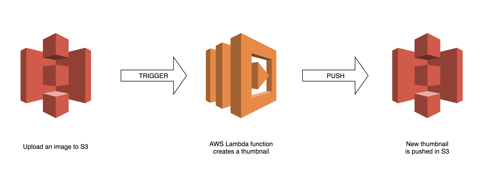

# Python S3 Thumbnail
In this project I am using the serverless deployment template to deploy a serverless app.

Working of the app:
1. Upload a file to the S3 bucket
2. This will trigger the Lambda function that will convert the image to a thumbnail
3. Thumbnail will be uploaded to the bucket with a _thumbnail suffix

## Architecture


### Requirements

Please install the following plugin:
https://github.com/UnitedIncome/serverless-python-requirements

```
npm install --save serverless-python-requirements
```

### Credits: 
* [AWS Lambda Documentation](https://docs.aws.amazon.com/lambda/latest/dg/welcome.html)
* [AWS Docs](https://github.com/awsdocs)
* [AWS Doc SDK Examples](https://github.com/awsdocs/aws-doc-sdk-examples)
* [AWS SDK for JavaScript examples](https://github.com/awsdocs/aws-doc-sdk-examples/tree/master/javascript)